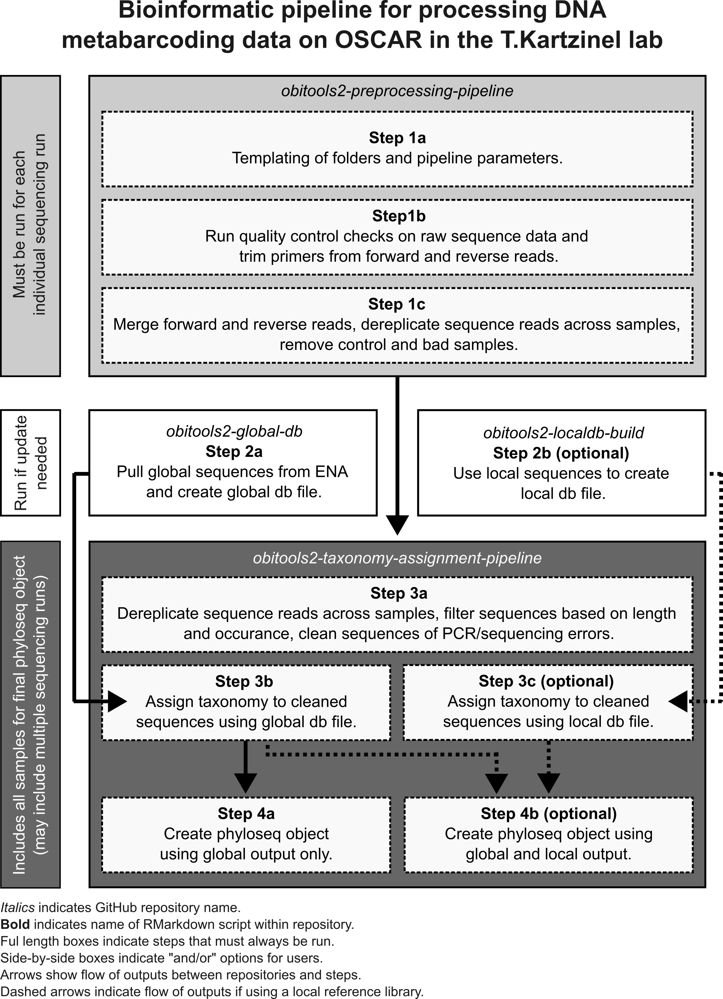
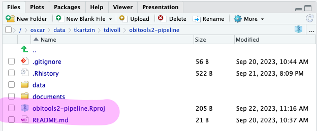
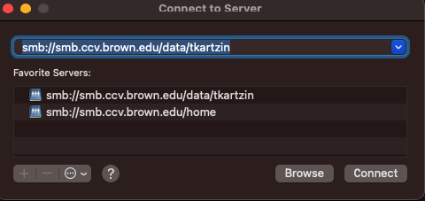

# obitools2-preprocessing-pipeline

This repository contains the code for pre-processing metabarcoding data with OBITools v.1.2.12 on Brown's high-performance cluster, OSCAR. 

**Note:** Pre-processing steps are run on individual sequencing runs to ensure that we can check "samples" and "controls" for contamination on a run-by-run basis. 

The steps included in this repository include:

1. setting up folder structure for conducting pre-processing steps (step 1a)

2. remove primers from forward and reverse sequence reads (step 1b)

3. merge reads, dereplicate reads, and check control samples for contamination (step 1c)

The schematic below shows the entire bioinformatic pipeline for DNA metabarcoding data, but the steps included in this repository are shown in the light grey box. 

## Connecting to Oscar

The following steps provide guidance on connecting to an RStudio server on Oscar. There are three ways to interact with Oscar: 

1. Through an [RStudio Server](https://docs.ccv.brown.edu/oscar/connecting-to-oscar/open-ondemand/using-rstudio) hosted on Open OnDemand. All interactions are through the various RStudio panes.

2. Through a virtual linux desktop called [Open OnDemand](https://docs.ccv.brown.edu/oscar/connecting-to-oscar/open-ondemand) (full desktop with access to files, a command-line shell, and RStudio)

3. Through a [SSH tunnel](https://docs.ccv.brown.edu/oscar/getting-started) in a terminal (command-line only)

Option #1 is recommended for this use case, and allows us to choose a newer version of R.

- [ ] If not on campus, make sure you are connected to the Brown [VPN](https://it.brown.edu/services/virtual-private-network-vpn)
- [ ] Navigate to the link in #1 and choose R version 4.3.1.
- [ ] Under Modules put `git miniconda3`.
- [ ] Launch the session once it has been allocated. 
- [ ] Go to the terminal pane in RStudio and `cd /oscar/data/tkartzin/<your folder>` (replace <your folder> with your user folder here)
- [ ] In that terminal `git clone https://github.com/trklab-metabarcoding/obitools2-preprocessing-pipeline.git`
- [ ] Also in the terminal: `cd obitools2-preprocessing-pipeline`
- [ ] In the Files panes of RStudio, use the menu at the top right to make sure you are also at the same path.
- [ ] Double-click the `.obitools2-pipeline.Rproj` file to set the project working directory. All of the notebooks are built from this working directory.

## Workflow structure

The main folders in this repository are:
- `images`: this is just for the images used in the README
- `data`: this can be used to copy over your dataset
- `template`: this contains `data`, `src`, and `test_data` folders
  - `src`: the notebooks for running the code, numbered 1b and 1c
  - `test_data`: a simple dataset to use for learning the workflow
  - `sample_sheet_test`: an example datasheet for use in step 1

## Getting sequencing data onto OSCAR

Raw sequencing data is stored in dated folders at `/oscar/data/tkartzin/projects/<project_code>/`. The permissions at this location are limited to trklab people.

Project codes include: 
- test: test data 
- YNP: Yellowstone
- FJ: Fray Jorge
- MRC: Africa projects (giraffes/UHURU)
- Banff
- SEV: Sevilleta

If you need to copy over data to OSCAR, the easiest way to do that is through the SMB client in your local Mac Finder app. Connect as described [here](https://docs.ccv.brown.edu/oscar/connecting-to-oscar/cifs) and use the path displayed in this example:

In the Finder window, drag and drop raw sequence files (fastq.gz) from local into a dated folder in the correct project code.

**Note:** The pipeline expects `.gz` file pairs for each sample (i.e. forward and reverse reads) so make sure both are copied over when transferring data.  

## Prepare your sample sheet

Before running step 1, you need to complete a sample sheet. In the parent directory, take a look at the `sample_sheet.xlsx` as an example and the fill out `sample_sheet_blank.xlsx` with your own metadata. Leave the sample sheet in the root directory of the repo. Dates should be in YYYYMMDD format (General or Text format in Excel).

**Note:** While we run pre-processing steps on individual sequencing runs, multiple sequencing runs can be processed at the same time, so it's important to include the folder name of where the sequencing data can be found in your sample sheet. 

## Running the Notebooks for Step 1:

**Note:** The first notebook (step_1a) is in the parent directory. Notebooks can be opened by double-clicking from the RStudio `Files` window.

### Step 1a. `Step1a_env_setup.Rmd`
The first step is to update all of the `params` in the YAML header of the first notebook. You can click "run all" from the drop-down menu at the top of the notebook to generate parameters and create environment variables.

This first notebook generates a new folder with today's date and time (e.g. 20240502T10:43:32Z). Within this folder, you will find individual folders for each sequencing data that you specified in your sample sheet. Inside these, this notebook copies over data, source notebooks, and an empty results folder.

For each sequencing date, you now need to navigate to the following notebooks. 

### Step 1b. `Step1b_data_prep.Rmd`
The second notebook is where you set all of your parameters for trimming, filtering, primers, etc. This notebook also runs `cutadapt` to trim primers from your forward and reverse reads. 

### Step 1c. `Step1c_data_processing.Rmd`
The third notebook merges forward and reverse reads for each sample, filters merged reads, and dereplicates sequences across all samples into a single FASTA file. There are interactive steps at the end to investigate controls and move any suspicious samples out of the analysis.

## Check for the latest code

There are a few git commands that can help make sure you always have the latest code versions when running your analyses.

From the Terminal in RStudio:
* `git status` - check which branch you are on and view staging area; you should see the `main` branch 
* `git pull` - this is always good to run after you verify you are on main. It will pull down any changes since the last time you ran an analysis.

## Tips for Development

Useful git commands:

* `git add <file>` - add a file to the staging area
* `git commit -m "<descriptive message>"` - commit the staged changes with a message (required)
* `git switch <branch>` - change to a different branch
* `git checkout -b <branch>` - make a new branch; just be aware of which branch you are currently on
* `git pull` - pull the latest changes from the remote repo; a good habit every time you switch to main
* `git stash` - stash the changes so your branch is clean before you switch to another branch
* `git stash pop` - pop the changes back out after you have switched to the desired branch

## Troubleshooting

* If your R session hangs, the environment variables will be lost, so it is best to start back at the top with Step 1a.
* When creating the conda environments in steps 1b and 1c, they only need to be created once. They will take some time to resolve dependencies when first created, but then can simply be activated each time they are needed thereafter.
